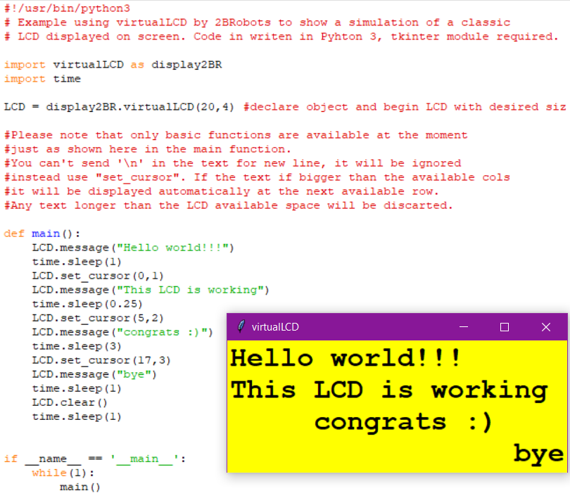

# virtualLCD
This python module allows to simulates a classic LCD on screen, so there is no need to attach a real one for testing. May be used to duplicate the showed data into this simulation and a physical one at same time.

Please note that only basic functions are available at the moment just as shown here in the main function.
You can't send '\n' in the text for new line, it will be ignored instead use "set_cursor". If the text if bigger than the available cols it will be displayed automatically at the next available row. Any text longer than the LCD available space will be discarted.

This module is designed to work on Pyhton 3, tkinter module is required.

Install script missing at the moment, to use the module only include a copy of it in the same folder your project is. Also compatible with Python2, but not tested yet.

Copyright (c) 2018 2BRobots

Author: dannimakes
